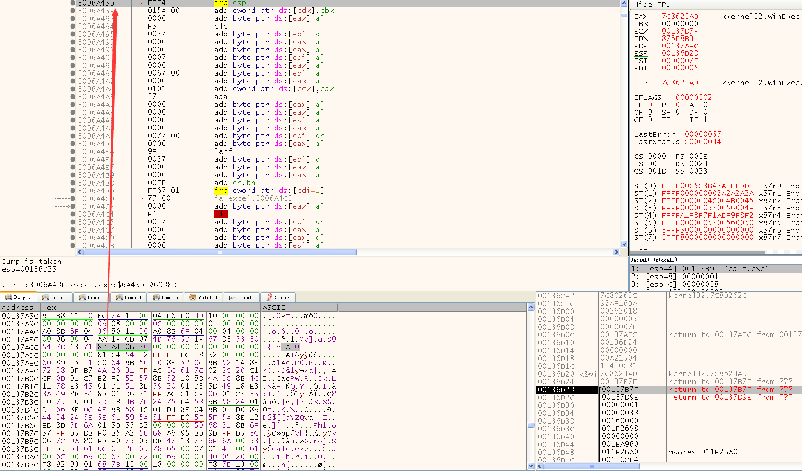
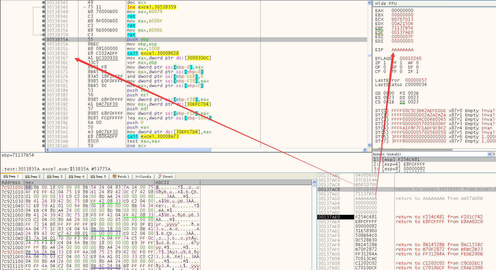

#### 漏洞介绍
#### 漏洞分析
首先确定漏洞溢出点，漏洞战争中是在Execl2003中分析的，因为跳板地址没有准确的覆盖到栈顶所以会导致异常发生，windbg可以捕获到溢出函数，本文是在Execl2007中分析的，不会发生异常，那么如何确定到发生栈溢出的函数呢。使用Metesploit生成执行calc.exe的POC，使用调试器执行Execl,在WinExec函数处下断点，在调试器中断后，我们查看返回地址已经在栈地址上了，我们查看Shellcode之前的位置，可以确定跳板地址。如下图。   

   

我们在POC中将如下地址更改为0xAAAAAAAA ,使用调试器再次加载execl，发生异常，中断到如下，所以我们可以确定，溢出发生在sub_3053835A函数或者他的调用函数中，溢出导致覆盖掉了sub_3053835A函数的返回地址。对sub_3053835A函数的返回地址下硬件写入断点，最终确定溢出函数发生在sub_3011A481，我们将其命名为Crash函数。  

  
来看一下，复制的大小以复制大小的数据来源。

```
char *__userpurge Crash_3011A481@<eax>(unsigned int a1@<eax>, int a2, void *Dst)
{
  signed int v3; // edi
  int v4; // ebx
  signed int v5; // ebp
  size_t v6; // esi
  signed int v8; // eax

  v3 = a1;
  if ( !a1 )
    return 0;
  if ( a1 > (unsigned int)Dst )
  {
    off_30EFEDE0(dword_30EFC7D4, 6);
    goto LABEL_14;
  }
  v4 = dword_30F12604;
  v5 = dword_30F0E5CC;
  Dst = (void *)a2;
  do
  {
    if ( v4 >= v5 )
    {
      v8 = v3;
      if ( v3 > 0x4000 )
LABEL_14:
        v8 = 0x4000;
      sub_3015D28B(v8);
      v4 = dword_30F12604;
      v5 = dword_30F0E5CC;
    }
    v6 = v5 - v4;
    if ( v3 < v5 - v4 )
      v6 = v3;
    v3 -= v6;
    memcpy(Dst, &dword_30F0E600[v4], v6);//此处发生溢出，在此处下断点，第二次中断后，如下图。
    Dst = (char *)Dst + v6;
    v4 += v6;
    dword_30F12604 = v4;
  }
  while ( v3 && v5 == 0x4000 );
  return (char *)Dst - a2;
}
```

复制的目的地址距离函数返回地址只有一个字节的大小，而复制的大小为E7，最终导致了溢出。

   

在使用py-offices-tools,发生了异常，没有像书中使用py-offices-tools解析完成，但是我们依然可以在POC中可以看到A7以及复制大小E7，根据书中描述，Execl在解析TOOLBARDEF[0xA7]Record时，若接下去的Record Type为CONTINUE[0x3c]Record时，则将CONTINUE的Len值0xe7作为复制字节数，而TOOLBARDEF[0xA7]记录中的Len值0x4于cbtn字段0x0c0f控制着复制的目标地址。
