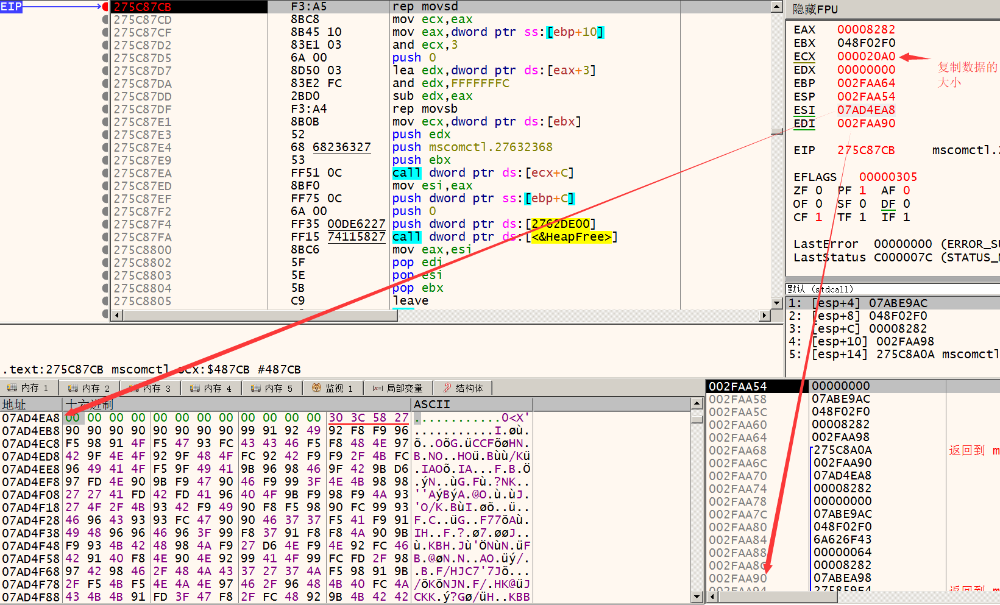
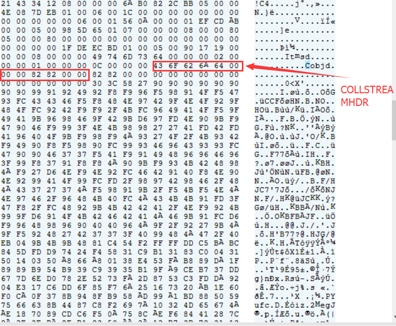

#### 漏洞介绍

#### 漏洞分析
使用Metasploit生成POC，利用oletools-rtf.py分析提取rtf文件。
利用和文章CVE-2011-0104一样的方法找到溢出点，如下。  

使用IDA查看一下复制数据前后的上下文，sub_275C89C7函数有0x14的大小，在第一次调用m_CraashFun_275C876D之后用掉0xc的大小，然后第二次调用m_CraashFun_275C876D发生栈溢出。
```
int __stdcall sub_275C89C7(int a1, BSTR bstrString)
{
  BSTR v2; // ebx
  int result; // eax
  int v4; // esi
  int v5; // [esp+Ch] [ebp-14h]
  SIZE_T dwBytes; // [esp+14h] [ebp-Ch]
  int destBuffer; // [esp+18h] [ebp-8h]
  int v8; // [esp+1Ch] [ebp-4h]

  v2 = bstrString;
  result = m_CraashFun_275C876D((int)&v5, bstrString, 0xCu);//第一调用m_CraashFun_275C876D复制0xc的数据到栈上，这些数据是COLLSTREAMHDR的结构。
  if ( result >= 0 )
  {
    if ( v5 == '0x6A626F43' && dwBytes >= 8 )//当COLLSTREAMHDR的dwMagic==0x6A626F43 以及大小大于8上，再次进行复制，最终导致溢出，
    {
      v4 = m_CraashFun_275C876D((int)&destBuffer, v2, dwBytes);
      if ( v4 >= 0 )
      {
        if ( !destBuffer )
          goto LABEL_8;
        bstrString = 0;
        v4 = sub_275C8A59((UINT)&bstrString, (int)v2);
        if ( v4 >= 0 )
        {
          sub_27585BE7(bstrString);
          SysFreeString(bstrString);
LABEL_8:
          if ( v8 )
            v4 = sub_275C8B2B(a1 + 20, v2);
          return v4;
        }
      }
      return v4;
    }
    result = -2147418113;
  }
  return result;
}
```

```
struct COLLSTREAMHDR
{
  DWORD dwMagic = 0x6A626F43;
  DWORD deVersion = 0x64;
  DWORD cbSize = 0x82282
}

```


利用offvis分析工具，针对rtf文件进行分析，我们来查看，复制的大小以及数据来自哪里。数据来自特殊构造的COLLSTREAMHDR结构，最终导致在复制OLE数据时导致溢出，复制到返回地址，导致任意代码执行，漏洞利用使用jmp esp 地址覆盖返回地址即可。


